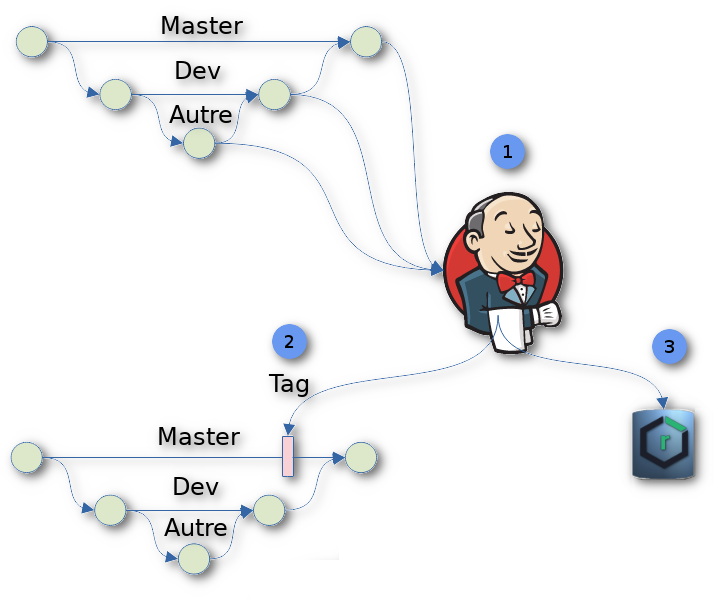

# Les scripts devops pour l'intégration continue.

1. Depuis [Jenkins](***REMOVED***/view/10677%20-%20Noms%20Geographiques/job/10677%20-%20Noms%20Geographiques%20-%20Continuous%20Deployment%20(CD)/),
lancer un déploiement en DEV simple avec [10677 - Noms Geographiques - Continuous Deployment (CD)](***REMOVED***/view/10677%20-%20Noms%20Geographiques/job/10677%20-%20Noms%20Geographiques%20-%20Continuous%20Deployment%20(CD)/) ou
lancer un déploiement avec une migration avec [10677 - Noms Geographiques - Continuous Deployment And Migration (CD)](***REMOVED***/view/10677%20-%20Noms%20Geographiques/job/10677%20-%20Noms%20Geographiques%20-%20Continuous%20Deployment%20And%20Migration%20(CD)/).
2. Pour créer un package dans Nexus, depuis [Jenkins](***REMOVED***/view/10677%20-%20Noms%20Geographiques/job/10677%20-%20Noms%20Geographiques%20-%20Continuous%20Deployment%20(CD)/),
lancer [10677 - Noms Geographiques - Packaging](***REMOVED***/view/10677%20-%20Noms%20Geographiques/job/10677%20-%20Noms%20Geographiques%20-%20Packaging/).
Un tag sera effectué, 
3. et le package sera construit et envoyé à Nexus.
## Intégration du déploiement continu dans un projet drupal
1. Créer le répertoire bin dans le serveur et copier les scripts dans votre projet :
```bash
$ rsync -av --exclude integration_continue <source>/scripts/ <user>@<serveur>:/srv/www/<user>/bin/
```
Dans le serveur, la structure doit être la suivante : 
```
bin/
|-- jenkins.sh
`-- utils_library.sh
``` 
3. assigner la bonne url du projet dans git-lab à la variable git_url dans le fichier utils_library.sh
4. dans Jenkins, créer les scripts sur le modèle existant.
```bash
name='noms-geographiques'
if [[ -d ${site_workspace}/bin ]]; then
   chmod u+x ${site_workspace}/bin/*.sh
   echo "Launching process ..."
   . ${site_workspace}/bin/jenkins.sh ${site_workspace} ${git_branch} ${git_user} ${git_pwd}  true
   if [[ -d ${site_workspace}/branch/${git_branch} ]]; then
     echo "setting execution permissions onto ${site_workspace}/branch/${git_branch}/scripts/integration_continue/*.sh."
     chmod u+x ${site_workspace}/branch/${git_branch}/scripts/integration_continue/*.sh
     echo "Nettoyage des liens dynamiques du site s'ils existent."
     . ${site_workspace}/branch/${git_branch}/scripts/integration_continue/cleaning.sh  ${site_workspace} ${php_path} ${git_branch}
     echo "Déploiement du site."
     . ${site_workspace}/branch/${git_branch}/scripts/integration_continue/update.sh ${site_workspace} ${php_path} ${git_branch} ${name}  true
   else
      echo "Le clonage de la branche ${git_branch} n'a pas ete fait."
   fi
else
   echo "Nothing to do."
fi
```
### jenkins.sh
Ce script va nettoyer le serveur soit supprimer la branche existante donner les droits à jenkinsadmin sur le system de fichier puis cloner l'application à déployer.

### utils_library.sh
#### Scripts dépandant de utils_library.sh
| nom du fichier   | Description                                               |  
|------------------|-----------------------------------------------------------|
| jenkins.sh       | Script principal.                                         |
| migration.sh     | Script de migration drupal d7 -> d9.                      |
| cleaning.sh      | Script de nettoyage avant déploiement.                    |
| update.sh        | Script de déploiement du site.                            |
| tagging.sh       | Script qui tag l'application clonnée.                     |
| packaging.sh     | Script de packaging et copie vers Nexus de l'application. |

Il contient deux variables :
- git_url   : Url du projet dans git-lab.
- nexus_url : Url du répertoire project_release de l'application dans Nexus.

Tous les scripts peuvent être utilisé pour tous les projet Drupal pour les déploiements continus dans cette méthode.

